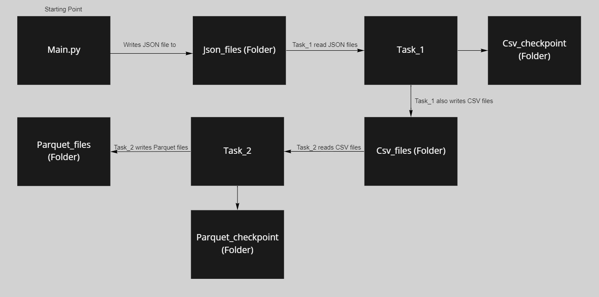

# Spark Streaming

---

### Table of Contents
- [Overview](#overview)
- [Program Flow](#program-flow)
- [Folder Structure](#folder-structure)
- [Executing the Program](#executing-the-program)
- [Task_1](#task_1)
- [Task_2](#task_2)
- [Clean Up](#clean-up)
- [Note](#note)
- [Level Up](#level-up)
- [Documentation](#documentation)

---

### Overview

- The purpose of doing this was to learn a bit about Spark Streaming. 
- Generated Click Stream data in JSON having certain attributes. 
- Read this JSON data in stream and did some transformation, write in CSV format in a different folder named as CSV.
- Another process will read this stream of data from the CSV folder do some aggregation and write in parquet format (interesting part as had to use foreachBatch instead of writeStream).

---

### Program Flow

  

---

### Folder Structure
- python_file
  - main.py   &nbsp;&nbsp;&nbsp;&nbsp;&nbsp;&nbsp;   -> Python file to generate the JSON data
  - data      &nbsp;&nbsp;&nbsp;&nbsp;&nbsp;&nbsp;&nbsp;&nbsp;&nbsp;&nbsp;&nbsp;  -> Inside this folder, more folders for JSON, CSV, parquet data to be stored in.
    - json_files
    - csv_files
    - parquest_files  
- Task_1.ipynb   &nbsp;&nbsp;&nbsp;&nbsp;&nbsp;&nbsp;-> This task reads the JSON data does some transformation and writes data in CSV to another folder
- Task_2.ipynb   &nbsp;&nbsp;&nbsp;&nbsp;&nbsp;&nbsp;-> This task reads the CSV data does some transformation and writes data in Parquet to another folder

- The checkpoints folder will be created after we execute Task_1 and Task_2.

---

### Executing the Program
- Before starting check that the folders inside the **data** folder are empty (CSV, Parquet, JSON, Checkpoints folder) once that is checked.
- Run the **main.py** file and that will generate the data in JSON.
- Run the **Task_1** it will consume the JSON files from JSON folder and then will write data in CSV format to the CSV folder.
- Run the **Task_2** it will consume the CSV files from the CSV folder and write the in Parquet format to parquet folder.
- Note the order of execution does not matter if you run Task_2 before Task_1 it will just wait for the files to come. 

---

### Task_1
- We use Spark Streaming to read the data from JSON folder and do some tranformation from nested to flat.
- The schema looks something like.
    - Analytics
      - Clicks
      - Impressions
    - Sales
      - Quantity
      - Total_Price
    - Datetime
- Provide a schema and change the datatypes of the columns so that aggregations can be performed.
- Write that data in CSV format to a CSV folder.

---

### Task_2

- We read the data from CSV folder and do some aggregation based on a window with watermark defined.
- We can output this data to our console as well for debugging purposes.
- Use the ForeachBatch to write the data in an append mode.

- Reason to use foreachBatch was that when we define the WaterMark of certain time that has to complete before it can write that to the folder
- Lets say we defined a **Window** of 10 seconds and **Watermark** of 30 seconds. The complete output for this 10 second window will be displayed after 30 seconds when the watermark has passed and in the 10 seconds windows we will get empty data. 

---

### Clean Up

- After you have executed the code and want to stop it use spark.stop() or restart the kernel in jupyter.
- We will have data files in all of the folder and have new checkpoint folders as well.
- You can continue the program if you only stopped the writeStream code part else if whole spark code stopped and you want to re-execute all clear all the data files and delete checkpoints as well.

---

### Note

- Do read the documentation around Spark Streaming.
- The outputModes (append, complete, update) do check them out and see for what formats they work and for which they do not.
- All of the above formats can work if we output to console but if we are writing to a file then only specific will work.
- Understand how foreach and foreachBatch work and can be used to push data to different databases.

---

### Level Up
- Currently we are just generating data and doing some transformations and writing it in different format.
- We use Kafka, kafka producer will generate this data, can have multiple of them and then Spark Streaming can consume.
- We can use data lake, or even a database to store this data instead of writing this in a file.
- Create more dimension like date, product and have a fact to store the data allowing us to have historical data as well.
- We can use some visualization tool to get more insigths and that to in near real time. Power BI can consume stream data directly.

---

### Documentation
- [Spark Streaming Basic](https://spark.apache.org/docs/latest/streaming-programming-guide.html)
- [Spark Streaming](https://spark.apache.org/docs/latest/structured-streaming-programming-guide.html)
